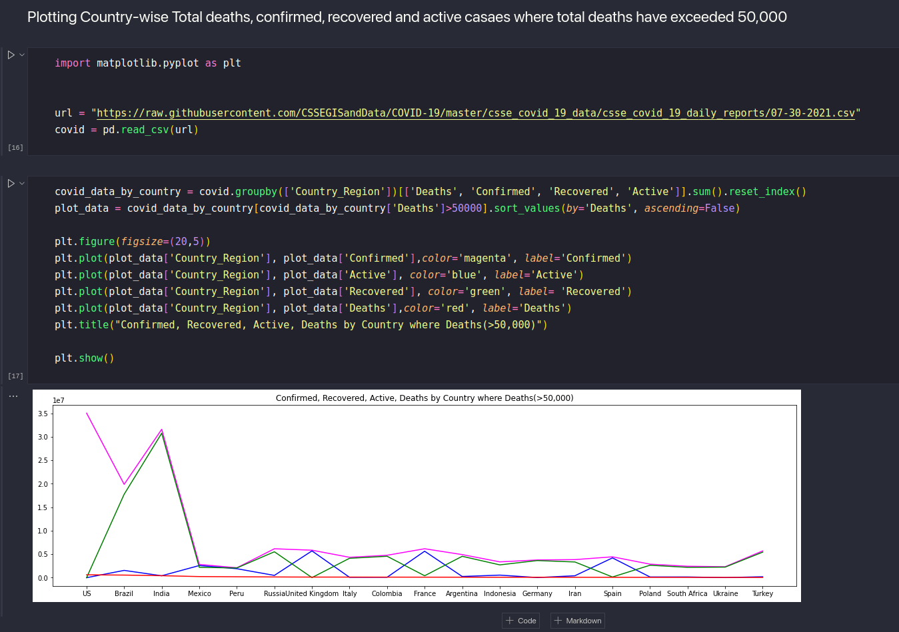
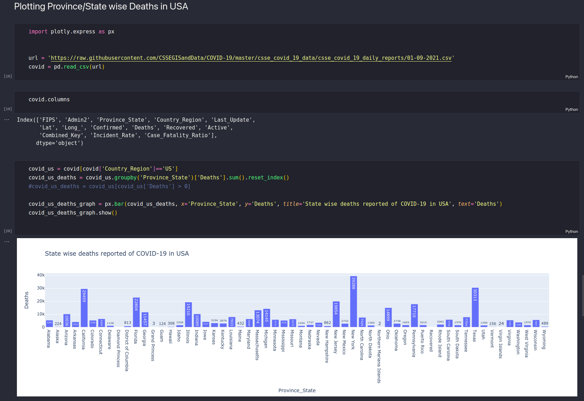
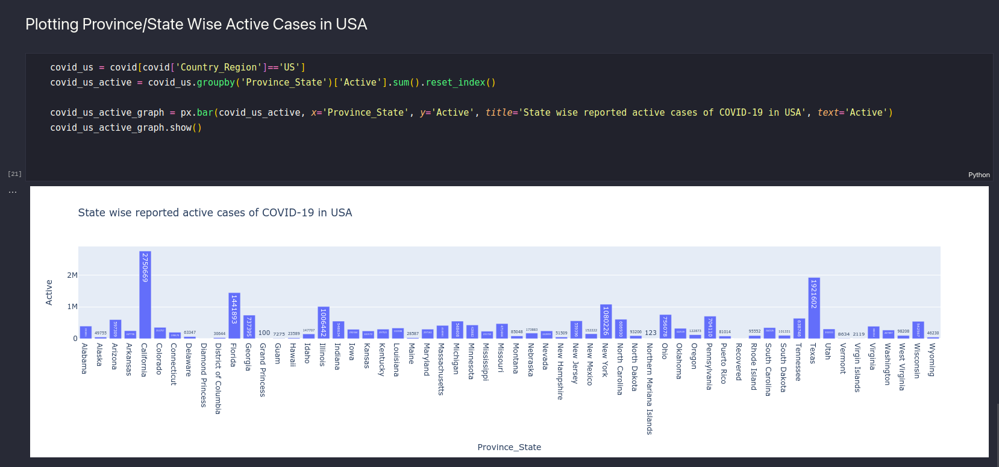
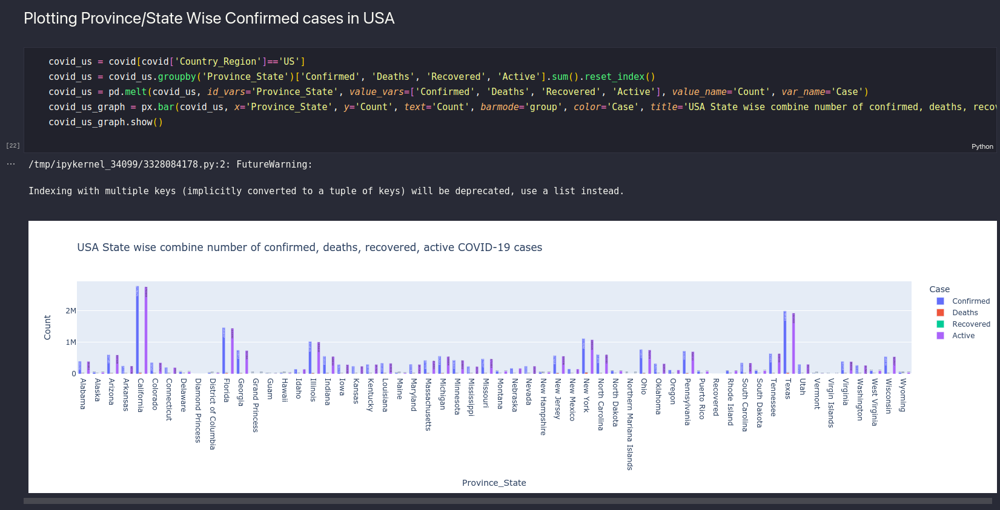

# COVID-19 Exploratory Data Analysis

## Overview

This is an Exploratory Data Analysis of COVID-19 cases using Pandas, Matplotlib and Plotly. Some code snippets can be seen below.

## Dataset

The data is collected and the dataset is put together by [CSSEGISandData](https://github.com/CSSEGISandData). The dataset is generated daily and can be found in this GitHub repository :

https://github.com/CSSEGISandData/COVID-19/tree/master/csse_covid_19_data/csse_covid_19_daily_reports

Since the format of the CSV is the same for all the daily reports, the same code found in the Python notebook can be used for any date by changing the URL to the required date.

## Code Snippets

